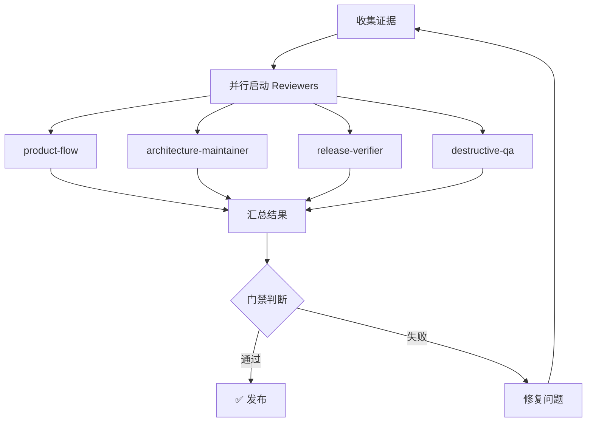

# Release Quality Review Skill

跨 Agent 工具的质量评审框架。基于「4 个常驻 Reviewer + 条件触发 Reviewer」的设计，支持 Claude Code、Codex 和其他 Agent 工具。

## 核心设计

```
常驻 Reviewers (每次必运行)
├── product-flow          # 产品闭环审查官
├── architecture-maintainer  # 工程架构审查官
├── release-verifier      # 验收发布审查官
└── destructive-qa        # 破坏性质量官

条件触发 Reviewers (按需启用)
├── native-designer       # UI 变更时
├── terminal-veteran      # CLI/本地服务变更时
├── data-security         # token/auth 变更时
└── zero-doc-user         # 文档/新用户场景时
```

## 快速开始

```bash
# 1. 运行完整评审 (推荐)
node skills/release-quality-review/scripts/review-runner.mjs --profile release-gate

# 2. 查看结果
cat quality-reports/round-001/summary.md

# 3. 修复问题后继续评审
node skills/release-quality-review/scripts/review-runner.mjs --profile release-gate --round 2

# 4. 单独运行某个 Reviewer
node skills/release-quality-review/scripts/review-gate.mjs --reviewer destructive-qa
```

## Profiles

| Profile | 用途 | Reviewers | 运行时间 |
|---------|------|-----------|----------|
| `quick` | 开发中快速检查 | product-flow, architecture-maintainer | ~5 分钟 |
| `default` | PR 合并前 | product-flow, destructive-qa, terminal-veteran | ~15 分钟 |
| `release-gate` | 发布前必须通过 | 全部常驻 + terminal-veteran | ~30 分钟 |
| `full` | 重大版本发布 | 全部 8 个 | ~60 分钟 |

## 评分标准

| 档位 | 分数 | 含义 | 行动 |
|------|------|------|------|
| A | 90-100 | 优秀 | 可以发布 |
| B | 80-89 | 良好 | 建议改进 |
| C | 70-79 | 及格 | 必须改进 |
| D | 60-69 | 不及格 | 需要重构 |
| F | <60 | 不可接受 | 打回重做 |

### 通过条件
1. **所有 Reviewer >= 90/100**
2. **无 P0 红线**
3. **有实际证据支撑评分**

## 目录结构

```
skills/release-quality-review/
├── SKILL.md                      # 本文件
├── review-config.yaml            # 项目级配置
├── profiles/
│   ├── quick.yaml
│   ├── default.yaml
│   ├── release-gate.yaml
│   └── full.yaml
├── reviewers/                     # Reviewer 定义 (canonical source)
│   ├── TEMPLATE.md               # 新建 Reviewer 模板
│   ├── product-flow.md           # 产品闭环审查官
│   ├── architecture-maintainer.md # 工程架构审查官
│   ├── release-verifier.md       # 验收发布审查官
│   ├── destructive-qa.md         # 破坏性质量官
│   ├── native-designer.md        # 原生审美设计师
│   ├── zero-doc-user.md          # 零文档新用户
│   ├── terminal-veteran.md       # 终端十年老兵
│   └── data-security.md          # 数据安全审查官
├── rubrics/
│   ├── scoring.md                # 评分标准
│   ├── redlines.md               # 红线规则
│   └── evidence.md               # 证据收集指南
├── scripts/
│   ├── review-gate.mjs           # 门禁检查器
│   └── review-runner.mjs         # 编排器
└── templates/
    └── result.yaml               # 结构化结果模板

.claude/                           # Claude Code 适配层
├── REVIEW-ORCHESTRATOR.md         # 评审编排器
└── reviewers/                     # Claude Code subagent 定义
    ├── product-flow.md
    ├── destructive-qa.md
    └── ...

quality-reports/                   # 评审输出
├── round-001/
│   ├── summary.md
│   ├── metadata.json
│   ├── product-flow/
│   │   ├── result.yaml           # 机器可读结果
│   │   ├── score.md
│   │   ├── blockers.md
│   │   └── improvement-list.md
│   └── ...
└── final-report.md
```

## Claude Code 使用

### 方式 1: Skill 命令
```
/review --profile release-gate
```

### 方式 2: 对话指令
```
请运行 release-quality-review skill，profile 为 release-gate，直到所有 Reviewer >= 90 且无红线。
```

### 方式 3: 直接执行
```bash
node skills/release-quality-review/scripts/review-runner.mjs --profile release-gate
```

### 方式 4: Claude Code Subagent 并行评审 (推荐用于 release-gate)

对于 release-gate profile，建议使用并行 subagent 加速评审：

```bash
# 1. 使用 review-runner.mjs 的并行模式
node skills/release-quality-review/scripts/review-runner.mjs --profile release-gate --parallel

# 2. 或在 Claude Code 对话中显式创建 subagent
# 主 agent:
/review --profile release-gate --parallel
```

### Claude Code Subagent 编排流程

当使用 `--parallel` 模式时，review-runner.mjs 会：

1. **收集证据** - 收集 git diff、测试输出、类型检查结果
2. **并行启动 Reviewers** - 每个 reviewer 在独立 subagent 中运行
3. **收集结果** - 等待所有 reviewer 完成
4. **汇总评分** - 生成 summary.md 和各 reviewer 的 score.md
5. **判断门禁** - 所有 >= 90 且无红线则通过



## Codex 使用

### 基本用法
```bash
# 读取 AGENTS.md 中的评审规则
# 然后运行评审
node skills/release-quality-review/scripts/review-runner.mjs --profile release-gate
```

### Codex Subagent 并行评审

Codex 需要显式 spawn subagents。推荐做法：

```
请读取 skills/release-quality-review/SKILL.md 和 AGENTS.md，然后：

1. 运行 node skills/release-quality-review/scripts/review-gate.mjs --collect-evidence 收集证据
2. 显式 spawn 以下 subagents（并行）：
   - product-flow reviewer: 读取 reviewers/product-flow.md，执行产品闭环评审
   - architecture-maintainer reviewer: 读取 reviewers/architecture-maintainer.md，执行架构评审
   - release-verifier reviewer: 读取 reviewers/release-verifier.md，执行验收发布评审
   - destructive-qa reviewer: 读取 reviewers/destructive-qa.md，执行破坏性质量评审
   - terminal-veteran reviewer（如有 CLI/本地服务）：读取 reviewers/terminal-veteran.md

3. 等待所有 reviewer 返回结果
4. 汇总到 quality-reports/round-XXX/
5. 如果任意 reviewer < 90 或存在红线，先修复最高优先级问题
6. 只有 review-gate.mjs 返回 pass 后才允许结束
```

### Codex 与 Claude Code 的关键差异

| 特性 | Claude Code | Codex |
|------|-------------|-------|
| 自动 subagent | 支持 | 需要显式 spawn |
| Skill 命令 | `/review` | 不支持，需用 node 脚本 |
| Hooks | 支持 | 不支持 |
| 内置 parallel | `--parallel` flag | 需手动编排 |

## 完整评审流程

### 标准流程 (release-gate)

```
Round 1: 全面扫描
├── 收集证据 (git diff, tests, typecheck)
├── 运行所有常驻 reviewers
├── 运行条件触发 reviewers (基于变更类型)
├── 汇总结果到 quality-reports/round-001/
└── 如有失败 → Round 2

Round 2: 针对性修复
├── 只运行上轮失败的 reviewers
├── 只运行与本轮修改相关的 reviewers
├── destructive-qa 做 sanity check
├── 汇总结果
└── 如有失败 → Round 3 或人工介入

Round N: 迭代直到通过或放弃
```

### 评审员输出文件

每个 reviewer 必须生成以下文件到 `quality-reports/round-XXX/<reviewer>/`:

| 文件 | 必需 | 内容 |
|------|------|------|
| `score.md` | 是 | 评分和详细分析 |
| `blockers.md` | 是 | P0/P1 红线列表 |
| `improvement-list.md` | 是 | P2/P3 改进建议 |
| `result.yaml` | 是 | 机器可读的标准化输出 |

### 证据收集要求

评审必须有实际证据支撑，不能只靠猜测：

**代码证据**
- 引用具体文件和行号
- 展示问题代码片段
- 对比修复前后的代码

**测试证据**
- 测试运行输出
- 测试覆盖率报告
- 边界条件测试结果

**截图证据** (UI 相关)
- 真机截图
- 设计稿对比
- 错误状态截图

**运行证据**
- 命令行输出
- API 响应
- 日志片段

## 添加新 Reviewer

1. 复制 `reviewers/TEMPLATE.md` 为新 reviewer 名称
2. 定义评审维度和权重 (总和 = 100%)
3. 定义红线规则 (P0/P1)
4. 添加到 `profiles/*.yaml` 的 `required_reviewers` 或 `conditional_reviewers`

## 退出码

| 退出码 | 含义 | 行动 |
|--------|------|------|
| `0` | 所有 Reviewer 通过 (>=90) | 可以发布 |
| `1` | 评分未达标 | 查看报告，修复问题 |
| `2` | 有 P0/P1 红线 | 必须先修复 |
| `3` | 测试失败 | 检查测试输出 |
| `4` | 配置文件错误 | 检查 profile/yaml |
| `5` | Agent 执行失败 | 查看错误日志 |

## 常见问题

**Q: 某个 Reviewer 一直不通过怎么办？**
A: 检查该 Reviewer 的 blockers.md，优先修复 P0/P1 问题。每轮只聚焦 2-3 个最高优先级问题。

**Q: 可以跳过某些 Reviewer 吗？**
A: 可以用 `--exclude-reviewer` 排除，但强烈不推荐。发布前必须通过 release-gate profile。

**Q: 评分有争议怎么办？**
A: 以实际证据为准。要求 Reviewer 引用具体代码/截图/测试结果。争议点记录到 improvement-list.md。

## 参考资源

- Superpowers 框架: https://github.com/obra/superpowers
- Claude Code Code Review 插件: https://pluginmarketplace.ai/plugin/code-review
- PR-Agent: https://github.com/The-PR-Agent/pr-agent
- reviewdog: https://github.com/reviewdog/reviewdog
